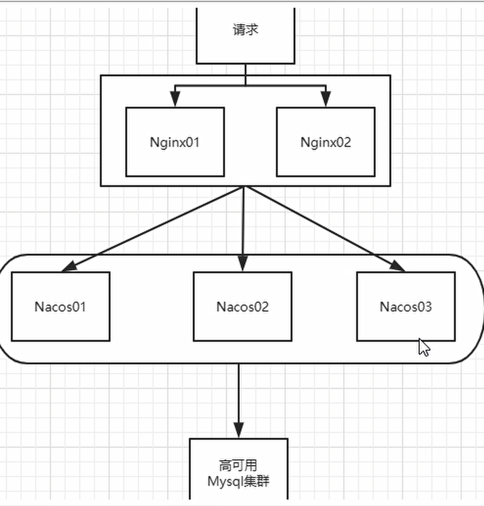
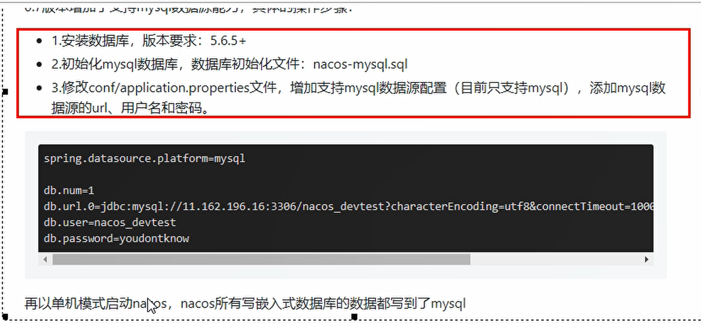

#### IDEA 基础
-file Encoding UTF-8
-Annotation Processor  Enable

#### 软件架构
- SpringCloud：Hoxton.SR3
- SpringBoot：2.2.5.RELEASE
- SpringCloud Alibaba：2.2.1.RELEASE
- JAVA：8
- Maven：3.5及以上
- MySQL：5.7及以上
- sleuth+zipkin: 服务链路追踪
- Swagger 接口文档抽取
- nacos 1.2.1 :服务注册与发现， 配置中心 ，消息总线bus. nacos 默认自带负载均衡，天生集成了ribbon
- sentinel：服务降级与熔断
- openFeign: 服务调用
- Ribbon：负载均衡
- gateWay: 服务网关
- 版本选择参照：https://blog.csdn.net/qq_38637558/article/details/114448690

#### 各个模块的作用
- Changan-Mall-Common 通用模块， 通用工具类，通用组件。
- Changan-Mall-Order-Core 订单原子模块
- Changan-Mall-Order-API  订单API  存放 Feginclient。
- Changan-Mall-Order-Edge 订单聚合服务模块
- Changan-Mall-Goods-Core 商品原子模块
- Changan-Mall-Goods-API  商品API  
- Changan-Mall-Goods-Edge 商品聚合服务模块
- Changan-Mall-Shop-Core 商家原子模块
- Changan-Mall-Shop-API  商家API  
- Changan-Mall-Advertisement-Core 广告位原子模块
- Changan-Mall-Advertisement-API  商家API  
- Changan-Mall-Shop-Edge 商家聚合服务模块
- Changan-Mall-System-Core 系统原子模块
- Changan-Mall-System-API  系统API 
- Changan-Mall-System-Edge 系统聚合服务模块
- Changan-Mall-GateWay 网关模块

#### 服务端口约定
- 网关服务，消费侧 端口700X
- 聚合服务，消费侧 端口800X
- 原子服务，消费侧 端口900X


#### 模块实体约定

Changan-Mall-Order-Core (原子服务)
   -com.ec.changan.bg.entities.po  下存放原子服务自己对应数据库实体

Changan-Mall-Common (通用common)
  -com.ec.changan.bg.entities  下存放所有服务都会使用到的实体
  -com.ec.changan.bg.entities.dto 存放服务之间调用需要使用到的扩展实体


#### 模块构建与测试

core
- 1. 建Module
- 2. 改pom.xml
- 3. 写配置文件YML
- 4. 主启动类
- 5. 业务类
    - Controller -> Service -> ServiceImpl -> Dao (Mapper) -> Entity

 **重点：** 
```
<!--引入自己定义的api调用包，可以使用Payment支付Entity-->
 <!--引入自己定义的api调用包，Entity-->
        <dependency>
            <groupId>com.ec</groupId>
            <artifactId>Changan-Mall-Common</artifactId>
            <version>${project.version}</version>
        </dependency>
```

聚合服务调用 原子服务 引入对应API jar

```
<!--引入自己定义的api调用包，可以使用Payment支付Entity-->
 <!--引入自己定义的api调用包，Entity-->
         <dependency>
            <groupId>com.ec</groupId>
            <artifactId>Changan-Mall-Order-API</artifactId>
            <version>${project.version}</version>
        </dependency>
```


#### sleuth+zipkin: 服务链路追踪
运行 ：java -jar zipkin-server-2.12.9-exec.jar

服务调用方，提供方引入
```
<!--包含了sleuth+zipkin-->
        <dependency>
            <groupId>org.springframework.cloud</groupId>
            <artifactId>spring-cloud-starter-zipkin</artifactId>
        </dependency>
```

yml 配置
```
spring:
application:
name: cloud-payment-service
zipkin:
base-url: http://localhost:9411
sleuth:
sampler:
# 抽取比例0-1
probability: 1
```

打开浏览器访问:http:localhost:9411

#### nacos 作为配合中心
- 导入配置
  DEFAULT_GROUP 默认将配置文件打进DEFAULT_GROUP.zip
- 从配置中心读取配置文件的规则
${spring.application.name}-${spring-profile.active}.${spring.cloud.nacos.config.file-extension}

### 生产使用nacos 作为配置中心
官网说明：
https://nacos.io/zh-cn/docs/cluster-mode-quick-start.html
预计需要，1个nginx+3个nacos注册中心+1个mysq


博客示例：https://cloud.tencent.com/developer/article/1805561

- 配置文件的持久化 (for 生产 Linux)
生产上的配置文件信息需要持久化，目前选择持久化到mysql中
原因：
默认nacos 使用的是嵌入式数据库存储 derby
所以如果使用nacos 集群，数据存储一致性会存在问题
为了解决这个问题，nacos 采用集中式存储方式来支持集群化部署。目前只支持mysql
-  


- nacos 的集群配置 (for 生产 Linux)
需要先做持久化配置。 这里主要是通过Nginx代理转发，让我们能通过一个地址访问到nacos上。

配置集群配置文件：nacos的解压目录nacos/的conf目录下，有配置文件cluster.conf
集群模式启动

#### sentinel

sentinel-dashboard-1.7.1.jar 提供一个web界面来细粒度话的配置限流规则 http://localhost:8080/#/dashboard/home
@SentinelResource： 注解那些资源需要被限流控制

### sentinel 持久化
配置的限流规则入库
将限流配置规则持久化进Nacos保存，只要刷新8401某个rest地址，
sentinel控制台的流控规则就能看到，只要Nacos里面的配置不删除，针对8401上Sentinel上的流控规则持续有效

目前的持久化需要在nacos 中手动 建立并配置流控规则。 比较麻烦
思考： 有没有一种方式，我们在sentinel中一配置，就自动更新到nacos中去

https://blog.csdn.net/LSY_CSDN_/article/details/105114573
https://www.imooc.com/article/289464 (重点参考)

https://blog.csdn.net/Hcy_code/article/details/121186654
网上已经有人改造好了个加强版。 直接拿来改改用
https://github.com/CHENZHENNAME/sentinel-dashboard-nacos

### 遇见问题 ：sentinel-datasource-nacos 中jackson-dataformat-xml依赖 会导致springcloud 返回的数据为XML 而不是JSON
如何解决？
https://blog.csdn.net/bilibili_CSDN/article/details/107104439
肯定是 去除依赖更有效